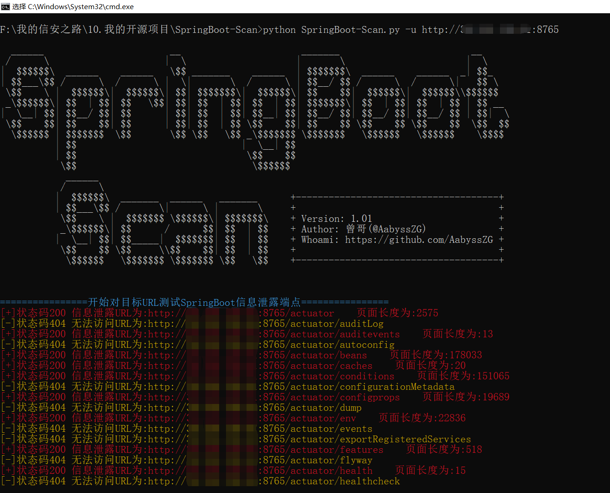
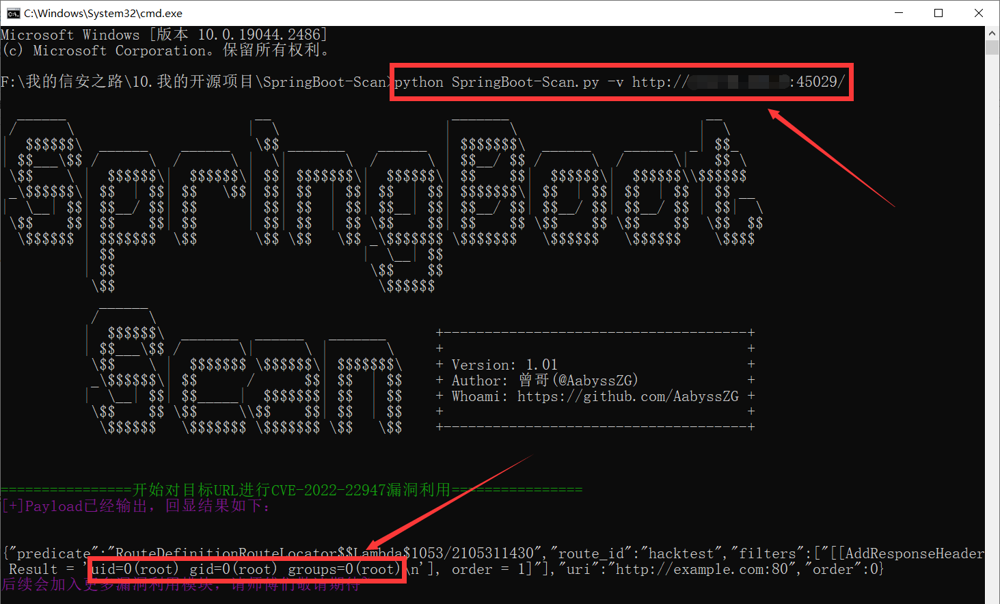
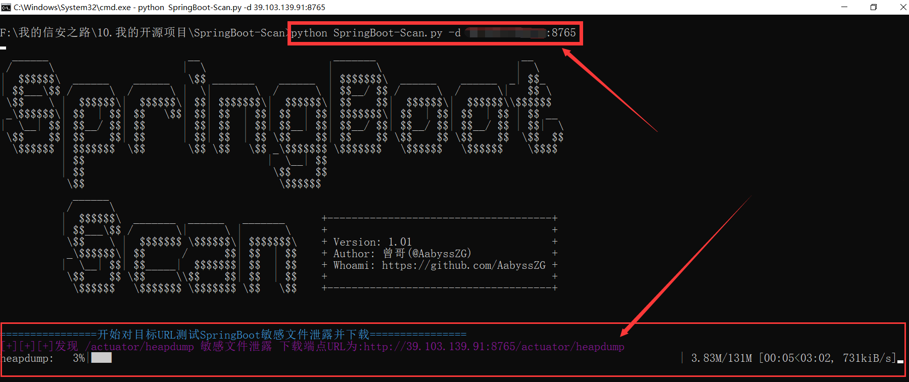

# SpringBoot-Scan
日常渗透过程中，经常会碰到Spring Boot搭建的微服务，于是就想做一个针对Spring Boot的开源渗透框架，主要用作扫描SpringBoot的敏感信息泄露端点，并可以直接测试Spring Boot的相关高危漏洞。

于是，就写了这么一个工具：SpringBoot-Scan  【简称：“SB-Scan”（错乱】

**同时，后期将加入更多漏洞利用内置模块（各位师傅能不能赏个Star嘛~码代码挺辛苦的哈哈）**

**我还整理了一篇SpringBootd的相关渗透姿势在我的个人博客，欢迎各位师傅前来交流哈哈：[https://blog.zgsec.cn/index.php/archives/129/](https://blog.zgsec.cn/index.php/archives/129/)**

# 工具使用
```
  ______                       __                      _______                        __
 /      \                     |  \                    |       \                      |  \
|  $$$$$$\  ______    ______   \$$ _______    ______  | $$$$$$$\  ______    ______  _| $$_
| $$___\$$ /      \  /      \ |  \|       \  /      \ | $$__/ $$ /      \  /      \|   $$ \
 \$$    \ |  $$$$$$\|  $$$$$$\| $$| $$$$$$$\|  $$$$$$\| $$    $$|  $$$$$$\|  $$$$$$\\$$$$$$
 _\$$$$$$\| $$  | $$| $$   \$$| $$| $$  | $$| $$  | $$| $$$$$$$\| $$  | $$| $$  | $$ | $$ __
|  \__| $$| $$__/ $$| $$      | $$| $$  | $$| $$__| $$| $$__/ $$| $$__/ $$| $$__/ $$ | $$|  \
 \$$    $$| $$    $$| $$      | $$| $$  | $$ \$$    $$| $$    $$ \$$    $$ \$$    $$  \$$  $$
  \$$$$$$ | $$$$$$$  \$$       \$$ \$$   \$$ _\$$$$$$$ \$$$$$$$   \$$$$$$   \$$$$$$    \$$$$
          | $$                              |  \__| $$
          | $$                               \$$    $$
           \$$                                \$$$$$$
            ______
           /      \
          |  $$$$$$\  _______  ______   _______      +-------------------------------------+
          | $$___\$$ /       \|      \ |       \     +                                     +
           \$$    \ |  $$$$$$$ \$$$$$$\| $$$$$$$\    + Version: 1.01                       +
           _\$$$$$$\| $$      /      $$| $$  | $$    + Author: 曾哥(@AabyssZG)             +
          |  \__| $$| $$_____|  $$$$$$$| $$  | $$    + Whoami: https://github.com/AabyssZG +
           \$$    $$ \$$     \\$$    $$| $$  | $$    +                                     +
            \$$$$$$   \$$$$$$$ \$$$$$$$ \$$   \$$    +-------------------------------------+


用法:
        对单一URL进行信息泄露扫描:         python3 SpringBoot-Scan.py -u example.com
        读取目标TXT进行批量信息泄露扫描:    python3 SpringBoot-Scan.py -f url.txt
        对单一URL进行漏洞利用:             python3 SpringBoot-Scan.py -v example.com
        扫描并下载SpringBoot敏感文件:      python3 SpringBoot-Scan.py -d example.com

参数:
        -u  --url       对单一URL进行信息泄露扫描
        -f  --file      读取目标TXT进行批量信息泄露扫描
        -v  --vul       对单一URL进行漏洞利用
        -d  --dump      扫描并下载SpringBoot敏感文件（可提取敏感信息）
```

**注意，本工具优化了使用者体验，不管是对单一URL扫描还是读取TXT进行批量扫描，`example.com` 和`http://example.com/` 以及`http://example.com` 都不会报错，程序会自行判断并识别**

**同时，解决了SSL证书问题，可以对采用SSL证书的Spring Boot框架进行扫描（自签名证书请改成 `http://` 即可）**

# 安装Python依赖库
```
pip3 install -r requirements.txt
```

# 工具演示

### 信息泄露字典

Dir.txt为内置的信息泄露端点字典，我基本收集齐了Spring Boot的相关敏感信息泄露端点

如果有遗漏，欢迎各位师傅跟我联系哈哈

### 对单一URL进行信息泄露扫描

```
python3 SpringBoot-Scan.py -u example.com
```



**注：扫描结束后，会把成功的结果导出为同目录下的urlout.txt**

### 读取目标TXT进行批量信息泄露扫描

```
python3 SpringBoot-Scan.py -f url.txt
```


**注：扫描结束后，会把成功的结果导出为同目录下的output.txt**

### 对单一URL进行漏洞利用

```
python3 SpringBoot-Scan.py -v example.com
```



默认执行 `id` Payload，只是证明漏洞存在即可，有需要可以提issue来添加一个命令自定义功能

**同时，后期将加入更多漏洞利用内置模块，请师傅们敬请期待~**

### 扫描并下载SpringBoot敏感文件

```
python3 SpringBoot-Scan.py -d example.com
```



**注：扫描到的敏感文件，会自动下载到脚本的运行目录，有进度条可以看到实时下载进度**

目前敏感文件目录内置了5个，如下：

```
actuator/heapdump
gateway/actuator/heapdump
heapdump
heapdump.json
hystrix.stream
```

如果有师傅有其他敏感文件的目录，可以提交issues，谢谢！！！
