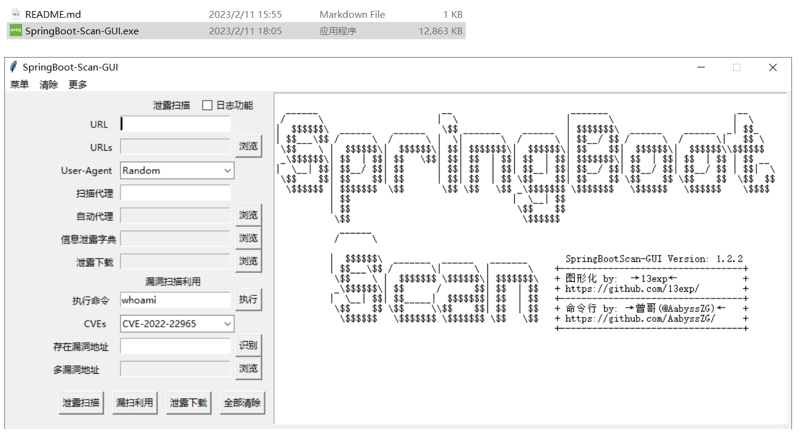
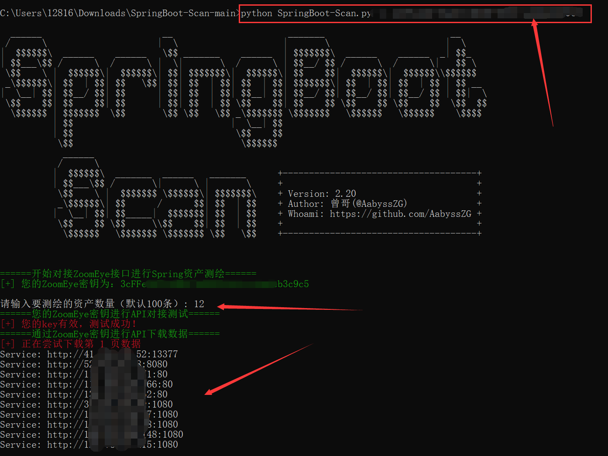
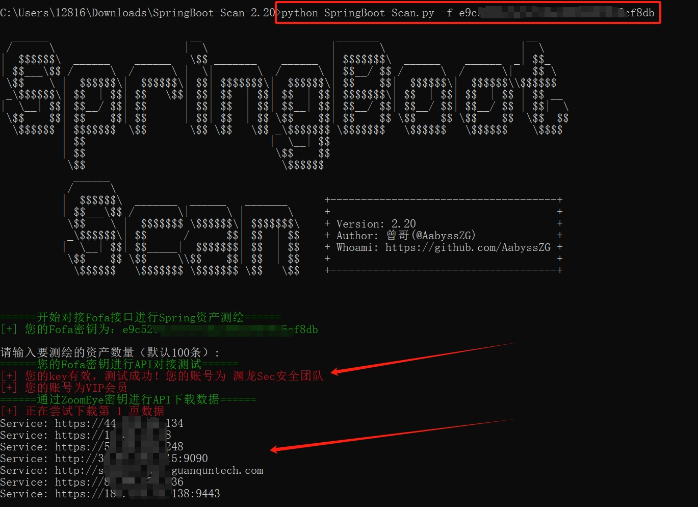

# ✈️ 一、工具概述
日常渗透过程中，经常会碰到Spring Boot搭建的微服务，于是就想做一个针对Spring Boot的开源渗透框架，主要用作扫描Spring Boot的敏感信息泄露端点，并可以直接测试Spring的相关高危漏洞。于是，就写了这么一个工具：SpringBoot-Scan  【简称：“SB-Scan”（错乱】

**当前工具版本号：V2.21-2023/12/22**

**我还整理了一篇SpringBoot的相关渗透姿势在我的个人博客，欢迎各位师傅前来交流哈哈：[https://blog.zgsec.cn/archives/129.html](https://blog.zgsec.cn/archives/129.html)**

# 📝 二、TODO

## 漏洞支持的更新

* [x] 添加支持2023 JeeSpringCloud 任意文件上传漏洞
* [x] 添加支持CVE-2022-22947 (Spring Cloud Gateway SpELRCE漏洞)
* [x] 添加支持CVE-2022-22963 (Spring Cloud Function SpEL RCE漏洞)
* [x] 添加支持CVE-2022-22965 (Spring Core RCE漏洞)
* [x] 添加支持CVE-2021-21234 (任意文件读取漏洞)
* [x] 添加支持2021 SnakeYAML_RCE 漏洞
* [x] 添加支持2021 Eureka_Xstream 反序列化漏洞
* [x] 添加支持2020 Jolokia配置不当导致RCE漏洞
* [x] 添加支持CVE-2018-1273（Spring Data Commons RCE漏洞）
* [x] 增加漏洞利用选择模块，可以选择单一或多个漏洞进行检测
* [x] 命令执行漏洞式支持交互式执行命令

后期将加入更多漏洞利用内置模块（各位师傅能不能赏个Star嘛~ 码代码挺辛苦的哈哈）

## 功能支持的更新

* [x] 新增Fofa资产测绘导出模块，自动对接API接口将资产导出至 `fofaout.txt`
* [x] 新增ZoomEye资产测绘导出模块，自动对接API接口将资产导出至 `zoomout.txt`
* [x] 在Spring端点爆破的时候，新增过滤一些无效回显的页面，提高工作效率
* [x] 对端点爆破字典进行优化，增加一些绕过语句，如果有补充欢迎提交
* [x] 支持自动对Spring进行指纹识别
* [x] 在漏洞利用模块，对错误进行输出为 `error.log`
* [x] 支持使用带认证的HTTP代理节点，自动检测节点状态
* [x] 由 `13exp` 师傅友情制作GUI图形化版本
* [x] 验证代理是否存活，并可以使用HTTP代理认证，支持使用HTTP/HTTPS代理所有流量
* [x] 随机User-Agent请求头
* [x] 解决SSL证书问题 (自签名证书请改成 `http://` 即可)
* [x] 智能识别目标地址 (`example.com` 和`http://example.com/` 以及`http://example.com` 都不会报错)

## 注明

- **本工具优化了使用者体验，不管是对单一URL扫描还是读取TXT进行批量扫描，`example.com` 和`http://example.com/` 以及`http://example.com` 都不会报错，程序会自行判断并识别**
- **解决了SSL证书问题，可以对采用SSL证书的Spring Boot框架进行扫描（自签名证书请改成 `http://` 即可）**
- **对于二级目录部署的Spring项目，直接给工具相应的路径就行了（比如 `example.com/test/` 这个路径部署了Spring项目，那直接将 `example.com/test/` 传参给工具就行了）**

**GUI图形化版本，由 [13exp](https://github.com/13exp/) 师傅友情制作，GUI地址：[https://github.com/13exp/SpringBoot-Scan-GUI](https://github.com/13exp/SpringBoot-Scan-GUI)**



**注：因为本项目的 `vul.py` 和GUI项目均包含漏洞利用模块，杀软报毒和查杀为正常情况。如果觉得工具不错，师傅们可以点个Star哈哈~**

# 🚨 三、安装Python依赖库
```
pip install -r requirements.txt
```

如果pip安装速度慢，可以采用国内源进行安装：

```
pip install -r requirements.txt -i https://pypi.tuna.tsinghua.edu.cn/simple/
```

# 🐉 四、工具使用

如何找到互联网上的Spring框架，ZoomEye语法如下：

```
app:"Spring Framework"
```

Fofa语法如下：

```
icon_hash="116323821"||body="Whitelabel Error Page"
```

本工具的参数如下：

```
# python3 SpringBoot-Scan.py
  ______                       __                      _______                        __
 /      \                     |  \                    |       \                      |  \
|  $$$$$$\  ______    ______   \$$ _______    ______  | $$$$$$$\  ______    ______  _| $$_
| $$___\$$ /      \  /      \ |  \|       \  /      \ | $$__/ $$ /      \  /      \|   $$ \
 \$$    \ |  $$$$$$\|  $$$$$$\| $$| $$$$$$$\|  $$$$$$\| $$    $$|  $$$$$$\|  $$$$$$\\$$$$$$
 _\$$$$$$\| $$  | $$| $$   \$$| $$| $$  | $$| $$  | $$| $$$$$$$\| $$  | $$| $$  | $$ | $$ __
|  \__| $$| $$__/ $$| $$      | $$| $$  | $$| $$__| $$| $$__/ $$| $$__/ $$| $$__/ $$ | $$|  \
 \$$    $$| $$    $$| $$      | $$| $$  | $$ \$$    $$| $$    $$ \$$    $$ \$$    $$  \$$  $$
  \$$$$$$ | $$$$$$$  \$$       \$$ \$$   \$$ _\$$$$$$$ \$$$$$$$   \$$$$$$   \$$$$$$    \$$$$
          | $$                              |  \__| $$
          | $$                               \$$    $$
           \$$                                \$$$$$$
            ______
           /      \
          |  $$$$$$\  _______  ______   _______      +-------------------------------------+
          | $$___\$$ /       \|      \ |       \     +                                     +
           \$$    \ |  $$$$$$$ \$$$$$$\| $$$$$$$\    + Version: 2.21                       +
           _\$$$$$$\| $$      /      $$| $$  | $$    + Author: 曾哥(@AabyssZG)             +
          |  \__| $$| $$_____|  $$$$$$$| $$  | $$    + Whoami: https://github.com/AabyssZG +
           \$$    $$ \$$     \\$$    $$| $$  | $$    +                                     +
            \$$$$$$   \$$$$$$$ \$$$$$$$ \$$   \$$    +-------------------------------------+


用法:
        对单一URL进行信息泄露扫描:         python3 SpringBoot-Scan.py -u example.com
        读取目标TXT进行批量信息泄露扫描:    python3 SpringBoot-Scan.py -uf url.txt
        对单一URL进行漏洞利用:             python3 SpringBoot-Scan.py -v example.com
        扫描并下载SpringBoot敏感文件:      python3 SpringBoot-Scan.py -d example.com
        使用HTTP代理并自动进行连通性测试:    python3 SpringBoot-Scan.py -p <代理IP:端口>
        通过ZoomEye密钥进行API下载数据:      python3 SpringBoot-Scan.py -z <ZoomEye的API-KEY>
        通过Fofa密钥进行API下载数据:         python3 SpringBoot-Scan.py -f <Fofa的API-KEY>
```

# 🛸 五、工具演示

## 0# Spring资产测绘

### 通过ZoomEye进行Spring资产测绘

本工具专门对接了ZoomEye的API接口，使用API-KEY即可批量下载Spring的资产测绘数据：

```
python3 SpringBoot-Scan.py -z <ZoomEye的API-KEY>
```



**注：资产测绘结束后，会把通过API下载的结果导出到 `zoomout.txt`，就可以使用其他参数进行操作啦**

### 通过Fofa进行Spring资产测绘

本工具专门对接了Fofa的API接口，使用API-KEY即可批量下载Spring的资产测绘数据：

```
python3 SpringBoot-Scan.py -f <Fofa的API-KEY>
```



**注：资产测绘结束后，会把通过API下载的结果导出到 `fofaout.txt`，就可以使用其他参数进行操作啦**

## 1# 测试并使用代理

```
python3 SpringBoot-Scan.py -p <代理IP:端口>
python3 SpringBoot-Scan.py -p <HTTP认证账号:HTTP认证密码@代理IP:端口>
```


比如我想对单一URL进行信息泄露扫描并使用代理
```
python3 SpringBoot-Scan.py -u example.com -p <代理IP:端口>
python3 SpringBoot-Scan.py -p <HTTP认证账号:HTTP认证密码@代理IP:端口>
```
同样，其他参数（`-u` / `-f` / `-u` / `-d`）均可以配合代理使用

## 2# 对单一URL进行敏感端点爆破

`Dir.txt` 为内置的Spring端点爆破字典，我基本收集齐了Spring Boot的相关敏感信息泄露端点

如果有遗漏，欢迎各位师傅跟我联系哈哈

```
python3 SpringBoot-Scan.py -u example.com
```


**注：扫描结束后，会把成功的结果导出为同目录下的 `urlout.txt`**

## 3# 读取目标TXT进行批量信息泄露扫描

```
python3 SpringBoot-Scan.py -uf url.txt
```


**注：由于版本更新，在2.21版本之后，读取TXT并扫描的参数改为 `uf`，扫描结束后，会把成功的结果导出为同目录下的 `output.txt`**

## 4# 对单一URL进行漏洞利用

```
python3 SpringBoot-Scan.py -v example.com
```


默认执行 `id` Payload，只是证明漏洞存在即可，有需要可以提issue来添加一个命令自定义功能

**同时，后期将加入更多漏洞利用内置模块，请师傅们敬请期待~**

## 5# 扫描并下载SpringBoot敏感文件

```
python3 SpringBoot-Scan.py -d example.com
```


**注：扫描到的敏感文件，会自动下载到脚本的运行目录，有进度条可以看到实时下载进度**

目前敏感文件目录内置了5个，如下：

```
actuator/heapdump
gateway/actuator/heapdump
heapdump
heapdump.json
hystrix.stream
```

如果有师傅有其他敏感文件的目录，可以提交issues，谢谢！！！

# 🖐 六、免责声明

1. 如果您下载、安装、使用、修改本工具及相关代码，即表明您信任本工具
2. 在使用本工具时造成对您自己或他人任何形式的损失和伤害，我们不承担任何责任
3. 如您在使用本工具的过程中存在任何非法行为，您需自行承担相应后果，我们将不承担任何法律及连带责任
4. 请您务必审慎阅读、充分理解各条款内容，特别是免除或者限制责任的条款，并选择接受或不接受
5. 除非您已阅读并接受本协议所有条款，否则您无权下载、安装或使用本工具
6. 您的下载、安装、使用等行为即视为您已阅读并同意上述协议的约束

# 🙏 七、感谢各位师傅

## Stargazers

[](https://github.com/AabyssZG/SpringBoot-Scan/stargazers)


## Forkers

[](https://github.com/AabyssZG/SpringBoot-Scan/network/members)


## Star History

[](https://star-history.com/#AabyssZG/SpringBoot-Scan&Date)
